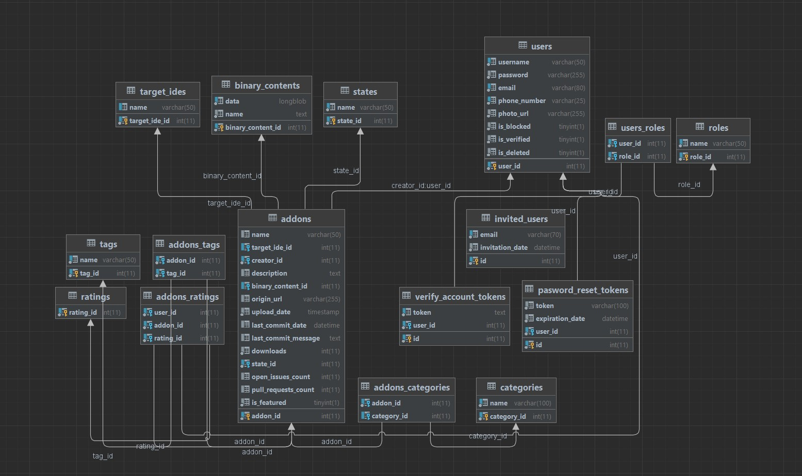

# Final Project - Addonis

**Project Description:**
- Addonis is a web application that enables users to upload and download plugins for different Integrated development environment (IDE). User visits the application and sees a
  lists with Addons separated in three categories: Featured(selected by our admins), Most popular(with most downloads) and Recently added(newest addons).
  The user will see the details of each addon and he will have the ability to download them. He also can search for specific addon in **See All Addons** page.
  If the user doesn't have registration he can fill the form in the **Register** page. After that he will receive an email from the application to verify his email.
  If the user already has a registration he can log in from the **Login** page. From there the user will be able to update their profile information, upload addons, save addons as draft, 
  which he can upload later, and edit or delete his existing addons. When the user upload a new addon, its state will be pending. Then our admins must check
  the addon, and if everything is fine, the addon will be approved. Of course, if something is not right, the admin has the power to reject the addon.
  The application informs the user by email and sends this addon to the user's Drafts list for another check. Only the creator of the draft addon can make changes on it.
  If user want to invite a friend to the application, he can do it from **Invite friend**, where he can enter the email of his friend and the application will send an email to this person 
  with link to the **Register** form.
  Our admins also have the ability to search for specific user, and to delete or block them. Blocked users are able to do everything as a normal user, except upload new or edit their addons.
  The addons of deleted users are still available to be downloaded. Admins are able to delete or edit any addon with state **Pending** and **Approved**.

- **Disclaimer:** The majority of our authentication tokens, API keys, passwords and secrets are stored in environment variables
  and outside the source code. This will unfortunately prevent you from running the code locally if you copy this project.

  

## Installation

### Prerequisites
The following list of software should be installed on your computer:
- [Java 11](https://www.oracle.com/java/technologies/javase/jdk11-archive-downloads.html)
- [MariaDB](https://mariadb.org/)

### Database Replication
- Run the scripts in the `DB folder` in the project

### Login Details
Our backend generates user passwords and encrypts them before saving them in the database
which is why we are providing here details you can use to login.

- Admin: username - `ppetrov12`,  password - `TestPass1!`
- User: username - `atanas_yovchev`,  password - `TestPass1!`

## Technologies

- **Java 11**
- **Spring MVC**
- **Spring Security**
- **Hibernate**
- **SQL**
- **MariaDB**
- **Mockito**
- **JUnit**
- **Email verification** (utilising SMTP)
- **GitLab CI/CD**
- **GitHub API**
- **Amazon Web Services** (AWS) Relational Database
- **HTML**
- **CSS**
- **Thymeleaf**
- **JavaScript**
- **JQuery**
- **AJAX**
- **Bootstrap**

### **Image of the database relations:**

